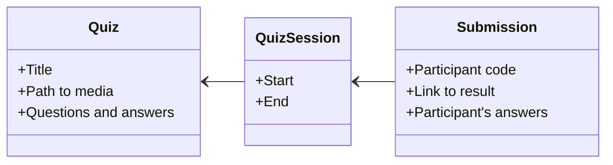

# 📚 AIDE Quiz

This is a web application for creating and conducting online quizzes.

AIDE Quiz is part of the **[AIDE Series (Artificial Intelligence for Development Engineers)](./docs/aide/AIDE.md)**. This means:

🟦 AIDE Quiz and its documentation were developed almost entirely with *Anthropic Claude Sonnet*, not through manual coding but through dialog sessions with the AI.

🟦 We recommend making extensions as part of computer science education in the same way, while also keeping an eye on the ongoing development of the architecture documentation, which can be accessed via the *icon with the small temple*.

## 🎯 Overview

This application consists of the following components:

1. **📝 Quiz Editor** - Teachers create and manage quizzes
2. **🎓 Quiz Sessions** - Students participate in live sessions
3. **🎓 Quiz Results** - Students can view their personal results
4. **📊 Statistics** - Evaluation of sessions

## 📂 Main Areas

### 1. Quiz Editor (for Teachers)

The editor enables complete quiz management:
- ✅ Questions with multiple-choice answers
- ✅ Media upload (images, videos, audio)
- ✅ Markdown support
- ✅ JSON editor with syntax highlighting
- ✅ Automatic validation
- ✅ Responsive design (preferably desktop)

---

### 2. Quiz Sessions (for Students)

Sessions are started by the teacher and have a unique session name (e.g., `2024-12-13-20-30`) as well as a defined start and end time.

Participants join via an HTML link generated by the teacher.

Participants receive fictional names and can modify them.

- ✅ Live quiz participation
- ✅ Immediate submission
- ✅ Optional: go through questions a second time and correct answers
- ✅ Responsive design (desktop & mobile)

---

### 3. Personal Evaluation

- ✅ Participants receive a link to their results after submission.
- ✅ The link only works after the session has ended.

---

### 4. Statistics

Teachers can view detailed statistics even during the session:
- ✅ Number of participants
- ✅ Answer distribution per question

---

## 🔒 Security

- ✅ Teacher area: Password-protected (session-based)
- ✅ Student area: Publicly accessible (only with session name)

---

## 📖 Further Documentation

... is located in the respective dialog

---

## 📝 License

To be clarified, but public in any case

---

## 🤝 Support

For questions or problems, contact Dr. Gero Scholz (gero.scholz(at)gmail.com).

---

**Last updated:** December 2025
