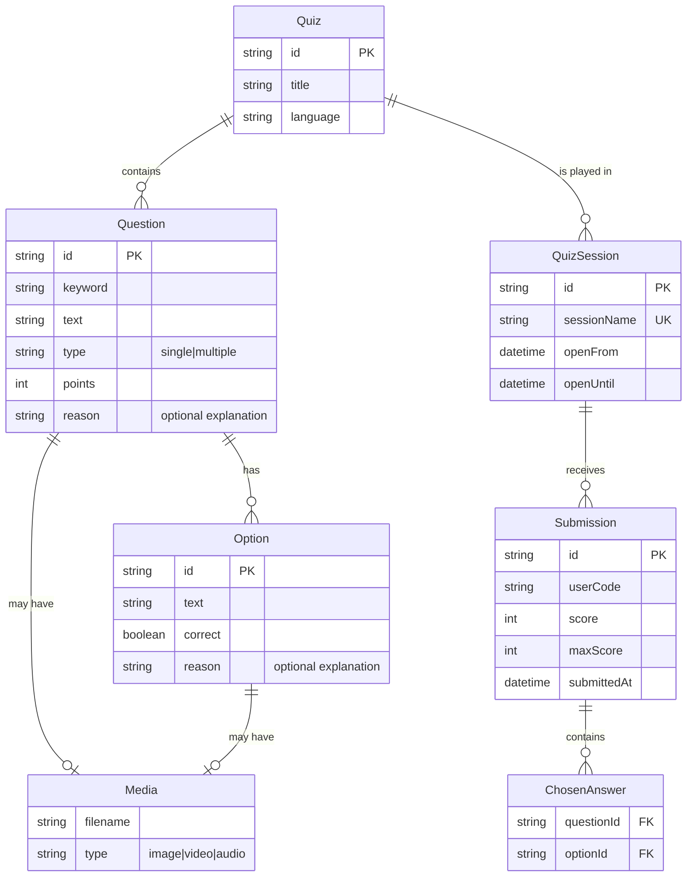
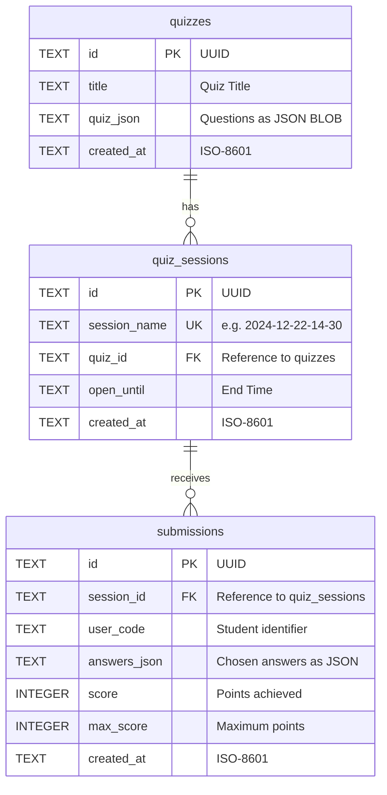

# 🗄️ Database Architecture

* There is a **logical view** of the application domain which is best expressed by "classes" (business entities including attributes and related functions) and their connections ("relations"). This is typically a "normalized" conceptual picture of the domain which avoids redundancies and defines "cardinalities" for all relationships between the entities.

* Then there is the world of User interfaces and reports, which reflects the **user perspective**, like the questionnaire, statistical reports etc. These are typically highly denormalized arrangements of the business entities, often only showing some attributes which are relevant for a specific purpose ("use case"), but also containing additional attributes which have been calculated by functions ("algorithmically redundant attributes").

* And there is a separate design for the **physical view**, i.e. the structure of persistent data which is usually best described by tables and integrity rules for their interrelationships. This design is based on the business class model but also reflects technical needs and optimisations.

---

## 📊 Logical View: Entities and Relations

The logical view of the application domain consists of concepts like quiz, questions, answers, sessions and submissions.



This normalized model shows all entities and their relationships. Note that **Question**, **Option** and **Media** form a tightly coupled unit that is always loaded and saved together with the Quiz.

---

## 📊 User View: Interactions and Reports

*(to be documented: Quiz-taking UI, Result display, Statistics reports)*

---

## 📊 Physical View: Tables and BLOBs

### The Hybrid Approach: Tables + JSON

The Quiz App uses **SQLite** with a **hybrid storage strategy**:

- **Relational tables** for entities that need to be queried independently (Quiz metadata, Sessions, Submissions)
- **JSON BLOBs** for nested structures that are always accessed as a unit (Questions, Options, Media references)

#### What is a BLOB?

A **BLOB** (Binary Large Object) stores complex data as a single serialized value. In our case, we use JSON text to represent the entire question/answer structure within a single database column (`quiz_json`).

#### Why this design?

| Aspect | Relational Tables | JSON BLOB |
|--------|-------------------|-----------|
| **Used for** | Quiz, Session, Submission | Questions, Options, Media |
| **Reason** | Need independent queries, FK constraints | Always loaded together, flexible structure |
| **Advantage** | SQL filtering, joins, indices | Atomic updates, schema flexibility |
| **Trade-off** | More tables, rigid schema | No SQL queries on question level |

The question/answer structure varies (single-choice, multiple-choice, with/without images, with/without explanations). Storing this as JSON avoids complex table hierarchies and allows easy schema evolution.

**Note:** A purely relational design with separate `questions` and `options` tables would make sense if the same questions were reused across different quizzes (question pools). We consider this a rare case for our application, so the simpler BLOB approach is preferred.

### Media Storage: Filesystem

Media files (images, audio, video) are stored in the **filesystem**, not in the database:

```
/data/quizzes/{quiz-title}/
  ├── image1.png
  ├── diagram.svg
  └── audio.mp3
```

**Why filesystem?**
- Large binary files don't belong in SQLite (performance, backup size)
- Direct serving via HTTP without database roundtrip
- Easy to browse, backup, and migrate independently
- Quiz JSON references media by filename only

### Database Schema



### The Quiz JSON Structure

The `quiz_json` column contains the complete question/answer hierarchy:

```json
{
  "id": "quiz_abc123",
  "title": "Mathematics Basics",
  "language": "en",
  "questions": [
    {
      "id": "q1",
      "keyword": "Addition",
      "text": "What is 2 + 2?",
      "type": "single",
      "points": 1,
      "image": "addition.png",
      "reason": "Basic arithmetic",
      "options": [
        { "id": "a", "text": "3", "correct": false },
        { "id": "b", "text": "4", "correct": true, "reason": "2+2=4" },
        { "id": "c", "text": "5", "correct": false }
      ]
    }
  ]
}
```

This maps to the logical entities **Question**, **Option**, and **Media** - but stored as a single BLOB rather than separate tables.

---

## 📚 Implementation Details

For technical details on the database implementation, see the source code:

- **Schema Definition:** `server/config/database.js`
- **Quiz Operations:** `server/repositories/QuizRepository.js`
- **Session Operations:** `server/repositories/SessionRepository.js`
- **Submission Operations:** `server/repositories/SubmissionRepository.js`

**Key design decisions:**
- SQLite as embedded database (no separate server needed)
- Prepared statements for SQL injection prevention
- Composite indices on `(session_id, user_code)` for fast lookups
- No explicit FK constraints (integrity managed in Repository layer)

---

**Last updated:** 2024-12-25
